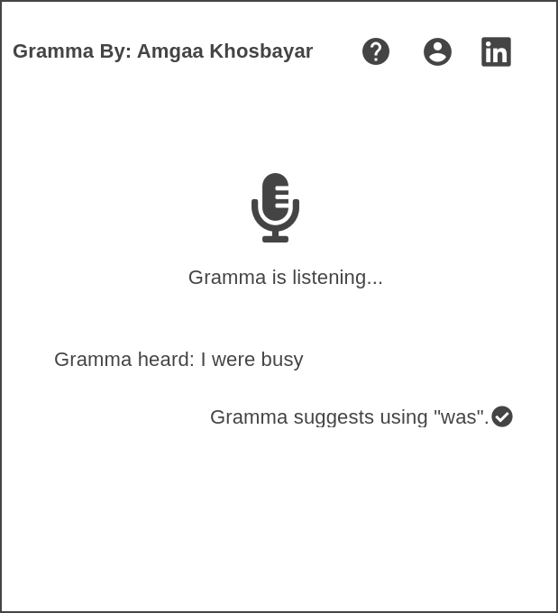

<!-- Write Project proposal here!!! -->

Gramma is a user interferace(kids friendly/ elder people friendly) voice grammar application for those who struggle with simple sentence structure in English.
I will use API to accurately convert speech into text, and I will use Gramma Api to correct the sentence.
After getting the correct sentence, user will be able to play with the words.

MVPs

1. Convert voice into text, gives the user option to edit the sentence by typing. has an instruction button.
2. Display the original text with the error-free version belove it, highlights the part where it needed correcting.
3. mini game where user can rearrange the words

Design structure

Architecture and Technologies
Gramma uses the following technologies:

1. Web speech API for converting audio to text input,
2. GrammarBot API for correcting the input text.
3. Vanilla Javascript, HTML, and CSS for all visual elements of the user interface.
